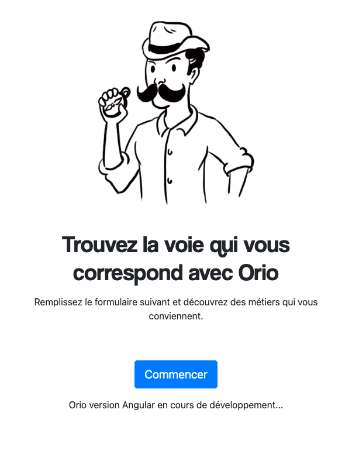

# Orio Front

## Introduction
Orio a été créée pour aider les lycéens à prendre des décisions éclairées concernant leur orientation et leur avenir professionnel.



Dans un nouvel élan d'innovation, le projet Orio est repris à zéro, avec une approche collaborative et open source. Cette décision vise à tirer parti des contributions diverses et à créer le projet de manière collective.

Parmi les fonctionnalités clés de l'application à venir :
- 559 fiches métier complètes pour une exploration approfondie.
- Un quizz interactif amusant pour découvrir les affinités professionnelles.
- Des mises à jour régulières avec de nouvelles fonctionnalités et des métiers ajoutés.
- Une interface conviviale pour une expérience utilisateur optimale.
- Possibilité de personnaliser et adapter l’application aux besoins des utilisateurs.

Cette transition vers un modèle de développement open source renforcera la robustesse de l'application Orio et permettra une évolution continue grâce à la collaboration variée.

Le développement d'Orio se déroulera en quatre parties distinctes : l'API, la version web, l'application mobile et le panneau administrateur. Chaque aspect sera pris en charge pour garantir une expérience complète et adaptée aux différents besoins des utilisateurs.


## Projet Information

- **Angular:** 17
- **Bootstrap:** 5.3.2

## Structure des Dossiers

- component/ : Ce dossier contient tous les composants de l'application. Les composants sont organisés par fonctionnalité ou par utilisation. Les composants partagés (réutilisables dans toute l'application) sont placés dans le dossier shared/.
- service/ : Ce dossier contient les services Angular utilisés pour la logique métier. Ces services peuvent être injectés dans les composants pour effectuer des opérations spécifiques.
- model/ : Ce dossier comprend les modèles de données utilisés dans l'application. Ces modèles représentent la structure des objets manipulés par les services.
- util/ : Ce dossier contient les utilitaires ou helpers partagés utilisés à travers l'application pour des tâches génériques telles que la manipulation de dates, les fonctions de formatage, etc.
- asset/ : Ce dossier contient les fichiers statiques tels que les images, les fichiers CSS et autres ressources utilisées dans l'application.
- environment/ : Ce dossier contient les fichiers de configuration d'environnement pour différentes configurations (par exemple, développement, production).

## Lancer le projet

1) Clonage du Projet
```xml
git clone https://github.com/votre-utilisateur/nom-du-projet.git
```

2) Installation des Dépendances (Assurez-vous d'avoir Node.js et npm installés sur votre machine.)
```xml
cd /nom-du-dossier
npm install
```

3) Lancement de l'Application
```xml
ng serve --open
```

4) Génération de Composants ou de Services
```xml
ng generate component component/nom-du-composant
ng generate service service/nom-du-service
```
